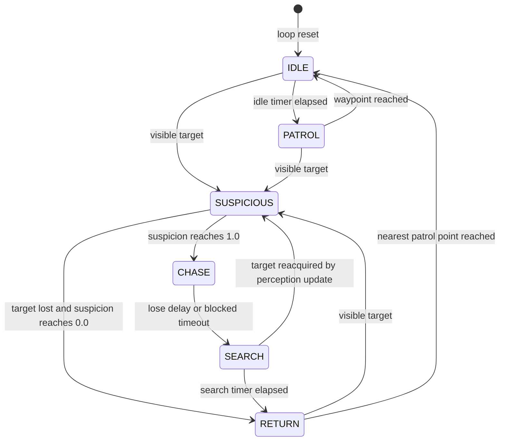

# Guard Stealth AI

문서 상태: MVP implementation reference
대상 구현: `GuardController`, `GuardPerception`, `GuardNavigation`, `GuardVisual`
엔진: Godot 4.7

## 1. 목적과 책임 경계

Guard는 전투 actor가 아니라 time-loop 퍼즐의 deterministic stealth obstacle이다. 현재 구현은 순찰, 시야 감지, 의심도, 추격, 수색, 순찰 복귀, Player capture를 담당한다. 체력, 피해, 공격, hearing/noise simulation은 포함하지 않는다.

책임은 다음처럼 나뉜다.

- `GuardController`: 상태 전환, 상태별 timer, 현재 target, suspicion, capture 조건, reset orchestration
- `GuardPerception`: 감지 후보 cache, 거리/시야각/line-of-sight 검사, deterministic target 정렬
- `GuardNavigation`: 단일 목표점을 향한 collision-aware direct steering과 blocked-time 측정
- `GuardVisual`: 4방향 animation, vision cone, `?`/`!`, suspicion meter, 선택적 debug label
- `GameplayLevel`: 공통 patrol route 유효성 검증과 Guard signal bridge
- `PrototypeLevel` / `FacilityLevel01`: 각 level의 authored route와 HUD/visibility 정책 구성
- `TimelineManager`: `captured`를 하나의 loop 종료 사유로 확정하고 recording 저장 및 다음 loop 시작

Guard는 `process_physics_priority = 200`으로 실행된다. Player는 기본 physics priority에서 먼저 이동하고, `TimelineManager`는 priority `100`에서 recording/Ghost를 갱신한 다음 Guard가 최신 위치를 감지한다.

## 2. 상태도



모든 상태 변경은 `transition_to(next_state)`를 통한다. 현재 상태로 다시 전환하는 요청은 no-op이므로 timer와 signal이 중복 초기화되지 않는다.

### IDLE

- 현재 위치에서 `idle_duration` 동안 정지한다.
- 마지막 facing을 유지하고 `idle_<direction>`을 재생한다.
- timer가 끝나면 다음 patrol index로 진행하고 `PATROL`로 전환한다.

### PATROL

- scene에 작성된 Marker 순서를 순환한다.
- `patrol_speed`로 현재 waypoint를 향해 이동한다.
- `waypoint_arrival_distance` 안에 들어오면 `IDLE`로 전환한다.
- 감지 target이 생기면 `SUSPICIOUS`로 전환한다.

### SUSPICIOUS

- 정지한 채 현재 target을 바라본다.
- target이 보이는 동안 suspicion을 선형 증가시키고, 보이지 않으면 선형 감소시킨다.
- suspicion이 `1.0`에 도달하면 `CHASE`, `0.0`에 도달하면 `RETURN`으로 전환한다.
- animation은 `alert_<direction>`, indicator는 주황색 `?`다.

### CHASE

- suspicion을 `1.0`으로 유지한다.
- target이 보이면 최신 위치를 last-seen position으로 저장하고 추격 목표를 제한된 주기로 갱신한다.
- target을 잃어도 `lose_target_delay` 동안 마지막 확인 위치를 향해 이동한다.
- lose delay가 끝나거나 진행이 `blocked_timeout` 동안 정체되면 `SEARCH`로 전환한다.
- facing은 이동 velocity 또는 target 방향을 따르고 animation은 `alert_<direction>`, indicator는 붉은 `!`다.

### SEARCH

- 마지막으로 본 위치까지 이동한다.
- 도착하거나 blocked로 판정되면 제자리에서 네 방향을 순서대로 바라보는 deterministic search를 수행한다.
- 무작위 위치나 난수를 사용하지 않는다.
- target을 다시 확인하면 perception 단계에서 `SUSPICIOUS`로 재진입하고, `search_duration`이 끝나면 `RETURN`으로 전환한다.

### RETURN

- 상태 진입 시 현재 위치에서 가장 가까운 patrol point를 선택한다. 거리 동률은 배열에서 앞선 point가 이긴다.
- 선택한 point에 도착하면 `IDLE`로 전환하고 정상 순찰을 재개한다.
- 복귀 중 target을 보면 `SUSPICIOUS`로 전환한다.

## 3. Perception

### Candidate cache

`GuardPerception`은 `Area2D`의 `body_entered`와 `body_exited`로 후보를 유지한다. 매 frame scene tree나 actor group 전체를 검색하지 않는다.

- detection collision mask: Player layer `2` + Ghost layer `4`
- 기본 radius: `vision_distance = 220 px`
- 기본 half-angle: `vision_half_angle_degrees = 38°` (전체 cone 약 `76°`)
- 기본 perception refresh: `0.05 s` (20 Hz)

비활성화될 때 candidate cache를 비운다. 삭제된 actor reference는 visible-target 검사 전에 정리한다.

### FOV 계산

target은 다음 조건을 모두 만족해야 보이는 것으로 처리된다.

1. `detectable_actor` group에 속한다.
2. actor의 `is_detectable_by_guard()`가 있다면 `true`를 반환한다.
3. target이 `vision_distance` 이내다.
4. normalized facing과 guard→target vector의 dot product가 half-angle의 cosine 이상이다.
5. Guard와 target 사이 World collision ray가 막히지 않는다.

Guard의 Perception node와 target 검사점은 발 위치보다 `18 px` 위에 있어 하체가 아닌 몸통 기준으로 시야를 판정한다.

### Line of sight

LOS는 `PhysicsDirectSpaceState2D.intersect_ray()`와 World mask `1`을 사용한다. Guard 자신의 RID는 query에서 제외한다.

- wall collider는 LOS를 차단한다.
- 닫힌 `SecurityDoor`는 World collider로 LOS를 차단한다.
- 열린 door는 blocker의 deferred disable이 같은 frame에 아직 반영되지 않았더라도 `SecurityDoor.is_open`을 확인해 ray exclude 목록에 넣고 다시 검사한다.
- open-door pass는 비정상적인 반복 hit를 막기 위해 최대 4회로 제한한다.

vision cone polygon은 학습용 근사 표현이며 벽 모양으로 실시간 절단되지 않는다. 실제 판정은 항상 위 LOS ray가 권위적이다.

## 4. Target 선택과 suspicion

현재 target 선택은 단순하고 deterministic하다.

1. visible current Player (`player_live`, priority `0`)
2. visible Ghost (priority `1`)
3. 같은 priority에서는 detection ID의 사전식 순서

Ghost ID는 source loop index로 만든 `ghost_001`, `ghost_002` 형태이므로 scene-tree insertion order에 의존하지 않는다. Player와 Ghost가 동시에 보이면 항상 live Player가 선택된다.

MVP는 Guard 하나당 현재 target 하나의 suspicion만 보관한다. `SUSPICIOUS` 중 target이 바뀌면 이전 target의 suspicion을 새 target에 넘기지 않고 `0.0`으로 초기화한다. 이미 `CHASE` 중이고 Ghost에서 live Player로 전환할 때는 alert 상태를 유지한다.

Suspicion은 모든 변경에서 `0.0...1.0`으로 clamp된다.

- visible: `suspicion_gain_per_second * delta`
- not visible: `suspicion_loss_per_second * delta`
- threshold: `1.0`

LOS query는 기본 20 Hz로 제한하지만 suspicion과 capture hold timer는 physics delta로 누적된다. 짧은 captured recording의 Ghost는 playback과 event dispatch가 모두 끝나면 `is_detectable_by_guard()`가 false가 된다. Sprite와 압력판 점유는 유지할 수 있지만 Guard는 끝난 Ghost를 계속 추격하지 않는다.

## 5. Movement와 collision

Guard body는 collision layer `32` (`Guard`), collision mask `1` (`World`)을 사용한다. Player와 Ghost를 물리적으로 밀지 않고, capture는 별도 판정으로 처리한다.

`GuardNavigation`은 navmesh pathfinding이 아니라 목표점까지의 direct steering을 제공한다.

- 목표 방향으로 velocity를 설정하고 `CharacterBody2D.move_and_slide()`를 호출한다.
- 한 physics tick에 목표를 지나치지 않도록 남은 거리와 delta로 속도를 제한한다.
- 목표까지의 진행량이 `0.05 px` 미만이면 blocked time을 누적한다.
- chase 목표는 기본 `0.1 s`마다, 또는 target이 기존 목표에서 `8 px` 이상 움직였을 때 갱신한다.

이 선택은 현재 tutorial map이 작은 직교 시설이고, authored patrol segment와 last-seen segment가 열린 통로 안에 배치되어 있기 때문이다. 프로젝트에는 현재 runtime NavigationRegion/navmesh가 없으므로 사용하지 않는 `NavigationAgent2D`를 추가해 pathfinding을 가장하지 않는다.

## 6. Capture와 Timeline

Player capture는 다음 조건을 모두 만족할 때만 누적된다.

- Guard state가 `CHASE`
- 현재 target이 live `PlayerController`
- target이 현재 시야에 있음
- 거리 `<= capture_distance`
- LOS가 열려 있음
- 조건이 `capture_hold_time` 동안 연속 유지됨
- 해당 loop에서 capture가 아직 확정되지 않음

조건이 하나라도 깨지면 capture timer는 `0.0`으로 돌아간다. Ghost는 추격 target이 될 수 있지만 capture되거나 제거되지 않는다. Scene의 `CaptureArea` radius는 export 값과 동기화되지만, 권위적인 capture 판정은 명시적 거리와 LOS 검사다.

Capture data flow:

```text
GuardController.capture_requested
→ GameplayLevel validates current live Player
→ GameplayLevel.player_captured
→ TimelineManager.request_loop_end("captured")
→ input and Guard simulation lock
→ capture feedback (default 0.45 s)
→ current recording finalized at capture timestamp
→ deterministic reset
→ saved recording spawns as a Ghost in the next loop
```

`TimelineManager`는 pending transition serial로 오래된 deferred/timer callback을 무효화한다. 동시에 여러 종료 사유가 들어오면 다음 우선순위를 사용한다.

```text
victory > captured > manual restart > timeout
```

따라서 capture와 victory가 경쟁하면 victory만 확정되고, capture와 timeout이 경쟁하면 captured recording 하나만 저장된다.

## 7. Deterministic reset

Timeline reset 순서는 다음과 같다.

1. live Player input 잠금
2. Guard simulation과 perception 비활성화
3. 현재 Player/Ghost 제거
4. 모든 `loop_resettable` object와 Guard 초기화
5. stable object registry 재검증
6. 저장 recording으로 Ghost 생성
7. 새 live Player 생성
8. recorder 시작과 Ghost playback cursor `0.0` 적용
9. Guard simulation 활성화
10. Player input 활성화

Guard reset은 다음 runtime state를 복원한다.

- initial global position, zero velocity, initial facing
- `IDLE` state와 patrol index `0`
- idle/lose/search/capture/navigation timer
- suspicion `0.0`
- current target와 last-seen position
- capture re-entry flag
- navigation target와 blocked time
- candidate cache와 perception disabled state
- idle animation, neutral cone, hidden indicators/debug label

simulation이 다시 켜진 뒤에도 `reset_perception_grace` 동안 감지를 비활성화한다. 기본 `0.75 s` grace는 actor/door physics state가 동기화되기 전에 이전 loop target을 다시 잡는 것을 막고 spawn 직후의 최소 안전 시간을 제공한다. Pause 중에는 SceneTree physics가 정지하며, victory와 pending loop transition은 Guard simulation을 명시적으로 끈다.

## 8. Patrol route 작성

Tutorial level은 Guard와 같은 level 아래에 별도 `GuardPatrolRoute` Node2D를 둔다.

```text
GameplayLevel
├── GuardPatrolRoute
│   ├── Point01 (Marker2D)
│   ├── Point02 (Marker2D)
│   ├── Point03 (Marker2D, optional)
│   └── Point04 (Marker2D, optional)
└── GuardController
```

설정 절차:

1. `patrol_route_path`를 Guard 기준 route NodePath로 지정한다.
2. route 아래에 최소 두 개의 `Marker2D`를 둔다.
3. child order가 순찰 순서가 되도록 scene에서 명시적으로 정렬한다.
4. 각 인접 point 사이의 직선 구간이 World collider를 가로지르지 않는지 확인한다.
5. Guard 초기 위치는 첫 point와 맞추는 것을 권장한다.

Guard는 `_ready()`에서 Marker의 global position을 cache한다. runtime에 route node를 이동하거나 child 순서를 바꿔도 자동 재수집하지 않는다. `GameplayLevel.validate_level()`은 point가 두 개 미만이면 시작을 거부한다. 보존된 prototype은 두 점 왕복 route를 사용하고, 기본 facility의 `guard_center_01`은 `(14,8) → (17,8) → (17,15) → (14,15)` 네 점 route를 사용한다.

## 9. Export variables

### GuardController

| 변수 | 기본값 | 역할 |
|---|---:|---|
| `patrol_speed` | `52 px/s` | PATROL/RETURN 이동 속도 |
| `chase_speed` | `96 px/s` | CHASE 이동 속도 |
| `idle_duration` | `0.7 s` | waypoint 대기 시간 |
| `suspicion_gain_per_second` | `1.4` | target visible 시 증가율 |
| `suspicion_loss_per_second` | `0.8` | target lost 시 감소율 |
| `lose_target_delay` | `0.5 s` | CHASE에서 SEARCH까지 유예 |
| `search_duration` | `2.5 s` | last-seen 위치 수색 시간 |
| `capture_distance` | `18 px` | capture 거리 |
| `capture_hold_time` | `0.2 s` | capture 조건 유지 시간 |
| `waypoint_arrival_distance` | `5 px` | waypoint 도착 허용 거리 |
| `perception_update_interval` | `0.05 s` | visible-target 갱신 간격 |
| `navigation_update_interval` | `0.1 s` | chase 목표 갱신 간격 |
| `blocked_timeout` | `0.8 s` | CHASE/SEARCH blocked 판정 시간 |
| `reset_perception_grace` | `0.75 s` | loop 시작 감지 유예 |
| `initial_facing` | `Vector2.RIGHT` | reset facing |
| `patrol_route_path` | scene 지정 | patrol Marker container 경로 |
| `debug_overlay_enabled` | `false` | Guard debug label 표시 |

### GuardPerception

| 변수 | 기본값 | 역할 |
|---|---:|---|
| `vision_distance` | `220 px` | detection radius와 cone 길이 |
| `vision_half_angle_degrees` | `38°` | facing 중심의 반각 |

### TimelineManager

| 변수 | 기본값 | 역할 |
|---|---:|---|
| `capture_feedback_seconds` | `0.45 s` | capture 확정 후 다음 loop 전 feedback 시간 |

## 10. Visual과 debug

Guard visual은 movement velocity의 dominant axis로 walk 방향을 고르고, 정지 중에는 마지막 facing 또는 visible target 방향을 유지한다.

- neutral: 낮은 alpha cyan cone, indicator hidden
- suspicious: orange cone, `?`, suspicion meter
- chase: red cone, `!`, full suspicion meter
- search: amber cone, `?`

상태는 색상만으로 전달하지 않고 icon과 meter를 함께 사용한다. cone polygon은 Guard ready/reset 때 거리와 각도에 맞춰 생성하며 매 frame geometry를 재생성하지 않는다.

`debug_overlay_enabled`를 editor에서 켜면 다음 값이 Guard 옆에 표시된다.

- state
- target detection ID
- suspicion
- patrol waypoint index
- capture timer

기본값은 false이고 runtime toggle input은 현재 제공하지 않는다. gameplay logic은 debug label에 의존하지 않는다.

## 11. 알려진 제한사항

- direct steering은 obstacle 주변 우회 경로를 계산하지 않는다. Patrol/return 구간은 직선으로 통과 가능한 위치에 작성해야 한다.
- `RETURN`에는 대체 route 탐색이나 blocked-time fallback이 없다. authored tutorial route는 이 상황을 피하도록 배치되어 있다.
- 동적으로 닫힌 문 반대편으로 이동한 Guard를 navmesh로 복구시키지 않는다. 일반 loop reset은 Guard를 초기 위치로 복원한다.
- vision cone은 벽에 맞춰 잘리지 않으며 실제 감지 범위의 근사 UI다.
- suspicion은 target별 history가 아니라 현재 target 하나만 관리한다.
- target 선택은 Player 우선과 stable ID 순서만 사용한다. 거리, 최근 확인 시각, target별 suspicion 가중치는 없다.
- hearing, noise propagation, cover, crouch, reinforcement, combat AI는 구현하지 않았다.
- patrol route는 runtime 변경을 지원하지 않으며 scene load 시 한 번 cache한다.
